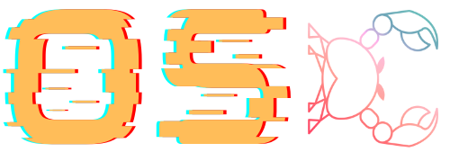

<div align="center">

</div>
<p align="center">Control your OpenStack cloud resources</p>

[](https://github.com/gtema/openstack/actions/workflows/functional.yml)
[](https://github.com/gtema/openstack/actions/workflows/ci.yml)
[](https://crates.io/crates/openstack_cli)
[](https://docs.rs/openstack_cli)
[](https://github.com/rust-lang/rust/blob/master/RELEASES.md#version-1760-2024-02-08)


# OpenStack Client Tools

Welcome to the world of next generation OpenStack client tools written in Rust.

As a programming language Rust is getting more and more traction in the low
level programming. It has very unique programming safety features what makes it
a very good fit in a complex world of OpenStack. As a compiled language it is
also a very good fit for the CLI tools allowing users to escape the python
dependency issues. In the containerization era placing a small size binary is
so much easier.

Current focus of the project is at introducing Rust as a programming language
into the ecosystem of OpenStack user facing tooling and provides SDK as well as
CLI and TUI.

## Design principles

After long time maintaining OpenStack client facing tools it became clear that
it cannot continue the same way as before. OpenStack services are very
different and are not behaving similar to each other. There were multiple
attempts to standardize APIs across services, but it didn't worked. Then there
were attempts to try to standardize services on the SDK level. This is
partially working, but require a very high implementation effort and permanent
maintenance. Reverse-engineering service API by looking at the API-REF
documentation is very time consuming. A huge issue is also that API-REF is
being a human-written document that very often diverges from the code what
leads to the issues when covering those resources in SDK/CLI. Tracking the API
evolving is another aspect of the maintenance effort.

As a solution a completely different approach has been chosen to reduce
maintenance effort while at the same time guaranteeing that API bindings match
to what service is supporting in reality. Instead of human reading the API-REF
written by another human who maybe was involved in the implementation of the
feature OpenAPI specs is being chosen as a source of truth. Since such specs
were also not existing and multiple attempts to introduce OpenAPI in OpenStack
failed the process was restarted again. Currently there is a lot of work
happening in OpenStack to produce specs for majority of the services. Main
component responsible for that is
[codegenerator](https://opendev.org/openstack/codegenerator). Apart of
inspecting source code of the selected OpenStack services it is also capable of
generating tools in this repository. There is of course a set of the framework
code, but the REST API wrapping and commands implementation is fully generated.

At the end of the day it means that there is no need to touch the generated
code at all. Once resources available in the OpenAPI spec of the service are
being initially integrated into the subprojects here they become maintained by
the generator. New features added into the resource by the service would be
automatically updated once OpenAPI spec is being updated.

Generating code from the OpenAPI has another logical consequence: generated
code is providing the same features as the API itself. So if API is doing thing
not very logical the SDK/CLI will do it in the same way. Previously it was
always landing on the shoulders of SDK/CLI maintainers to try to cope with it.
Now if API is bad - API author is to blame.

- Code being automatically generated from OpenAPI specs of the service APIs.
- Unix philosophy: "do one thing well". Every resource/command coverage tries
to focus only on the exact API. Combination of API calls is not in scope of the
generated code. "Simple is better then complex" (The Zen of Python).
- SDK/CLI bindings are wrapping the API with no additional guessing or
normalization.
- User is in full control of input and output. Microversion X.Y has a concrete
body schema and with no faulty merges between different versions.

## Components

- `openstack_sdk` - SDK
- `openstack_cli` - The new and shiny CLI for OpenStack
- `openstack_tui` - Text (Terminal) User Interface
- `structable_derive` - Helper crate for having Output in some way similar to
  old OpenStackClient
- `xtask` - Workflow helper
- `doc` - Project documentation

## Trying out

Any software is created to be used.

### Install binary

It is possible to install compiled version from the GitHub releases. It comes
with a dedicated installer in every release and can be retrieved with the
following command:

```console
curl --proto '=https' --tlsv1.2 -LsSf https://github.com/gtema/openstack/releases/download/openstack_cli-v0.8.2/openstack_cli-installer.sh | sh
```

TUI can be installed similarly:

```console
curl --proto '=https' --tlsv1.2 -LsSf https://github.com/gtema/openstack/releases/download/openstack_tui-v0.1.6/openstack_tui-installer.sh | sh
```


### Build locally
Alternatively it is possible to compile project from sources. Since the project
is a pure `Rust` it requires having a Rust compile suite.

```console
cargo b
```

### Run

Once the binary is available just start playing with it. If you already have
your `clouds.yaml` config file from `python-openstackclient` you are free to
go:

```console
osc --help
osc --os-cloud devstack compute flavor list
```

### Functional testing

SDK and CLI are coming with a set of basic functional tests.

To trigger functional tests invoke:

```console
OS_CLOUD=devstack cargo t --test functional
```

## Benchmarks

Rust is known to deliver nearly maximum possible performance being only
marginally slower compared to C. The table below presents time comparison
between `python-openstackclient` (isolated virtual environment) and `osc` on
the Intel i5-5250 (2 cores) on a reference public cloud (not local devstack)
and token caching enabled. Benchmarking is performed using
[hyperfine](https://github.com/sharkdp/hyperfine) tool.

| Test | python-openstackclient | osc (Rust) |
|------|--------|------|
| `catalog list` | 1.54s | 68ms |
| `flavor list` | 2.6s | 830ms |
| `server list` (empty) | 1.8s | 210ms |
| `server list` (10 entries) | 4.0s | 709ms |
| `image list` | 2.4s | 560ms |
| `network list` | 1.8s | 330ms |
| `volume list` | 1.9s | 270ms |
| `container list` | 1.3s | 370ms |
| `object list` (3200 files) | 2.4s | 1.0s |
| `object list` (10000 files) | 3.8s | 1.7s |

**Note:** Performance results depend heavily on the time spent waiting for the
API response. High amount of long API requests causes smaller performance
difference.

## Terminal User Interface (TUI)

Exploring the cloud resources using CLI is not something very comfortable. A
terminal user interface imroves user experience when a quick look at currently
present resources is required.

openstack_tui (`ostui` as a binary name) is such TUI built upon
[Ratatui](https://ratatui.rs) and inspired in functionality by
[k9s](https://k9scli.io) that provides TUI for Kubernetes.


## Software security

Security is being taken seriously. Every step of the development and release
process is designed with security in mind. OpenSSF Scorecard is embedded into
the pipeline and helps identifying potential improvements or the
vulnerabilities.

### RustSec

Binary deliveries are built with
[cargo-audit](https://github.com/RustSec/rustsec/tree/main/cargo-audit). This
allows embedding information about used dependencies directly into the binary.
Popular scanning tools like `trivy` or `syft` already know how to extract this
information.

```console
cargo audit bin osc
```

### GitHub Attestations

All artifacts can be verified using GitHub Attestations (using the GitHub binary)

```console
gh attestation verify <file-path of downloaded artifact> --repo gtema/openstack
```

## Support

The project is a private initiative. If you find it useful or just want to
support it please consider [GitHub
sponsoring](https://github.com/sponsors/gtema). Pull Requests, Issues or other form
of support are of course welcome as well.
