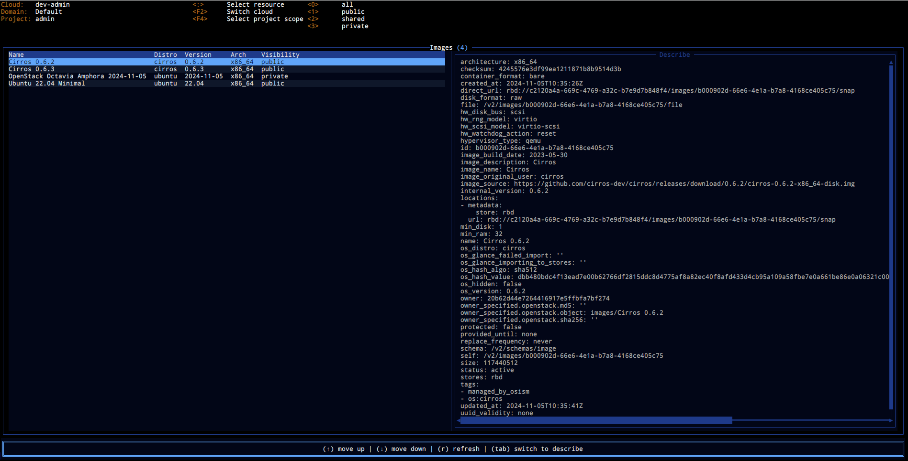

# Text (Terminal) User Interface

Live navigating through OpenStack resources using CLI can be very cumbersome.
This is where `ostui` (a terminal user interface for OpenStack) rushes to help.
At the moment it is in a very early prototyping state but already saved my day
multiple times.

It is not trivial to implement UX with modification capabilities for OpenStack,
especially in the terminal this is even harder. Therefore primary goal of
`ostui` is to provide a fast navigation through existing resources eventually
with some operations on those.

Support for new resources is being permanently worked on (feel free to open
issue asking for the desired resource/action or contribute with the
implementation). For the moment documentation and implementation are not
directly in sync therefore much more resources may be implemented than
included in documentation.

## Features

- switching clouds within tui session
- switching project scope without exploding `clouds.yaml`
- resource filtering
- navigation through dependent resources
- k9s similar interface with (hopefully) intuitive navigation

## Installation

Compiled binaries are always uploaded as release artifacts for every
`openstack_tui_vX.Y.Z` tag. Binary for the desired platform can be downloaded
from GitHub directly or alternatively compiled locally when rust toolchain is
present.
