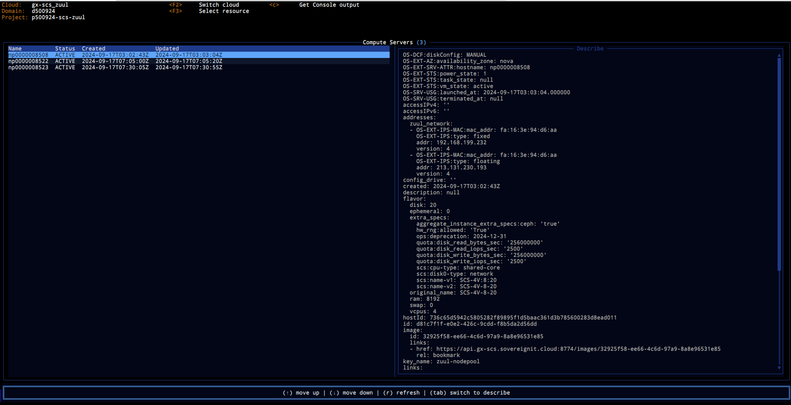

# Text (Terminal) User Interface

Live navigating through OpenStack resources using CLI can be very cumbersome.
This is where `ostui` (a terminal user interface for OpenStack) rushes to help.
At the moment it is in a very early prototyping state but already saved my day
multiple times.

It is not trivial to implement UX with modification capabilities for OpenStack,
especially in the terminal this is even harder. Therefore primary goal of
`ostui` is to provide a fast navigation through existing resources eventually
with some operations on those.

