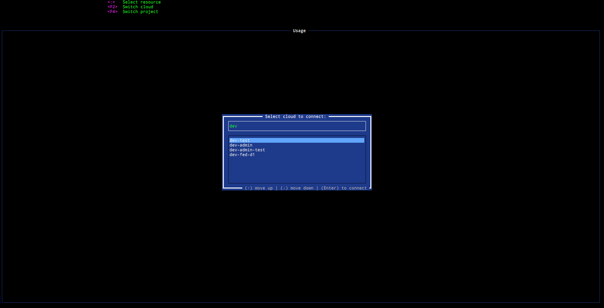

# Cloud connection

`ostui` reads your `clouds.yaml` file. When started with `--os-cloud devstack`
argument connection to the specified cloud is being immediately established.
Otherwise a popup is opened offering connection to clouds configured in the
regular `clouds.yaml` file.

While staying in the TUI it is always possible to always switch the cloud by
pressing `<F2>`

