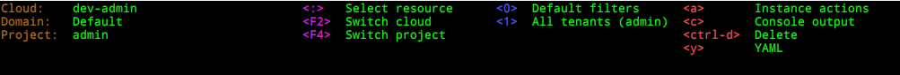

# Header

In every mode TUI header show the context specific information. It is
represented in few columns using different colors.

First column shows information about current connection

Second column shows selected global keybindings that are not context specific
(a sort of magenta color).

Following columns are context specific and may be present or not.

Keybindings in blue color are used to filter results of the current view.

Red color is used by the keybindings as an action on the selected entry.

Note: colors are subjective and may be changed by the configuration file as
well as altered by the terminal or display device.

