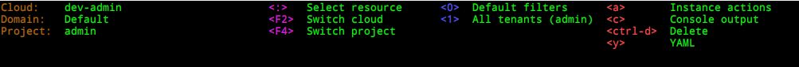

# Header

In every mode TUI header show the context specific information. It is
represented in few columns using different colors.

First column shows information about current connection

Second column shows selected global keybindings that are not context specific
(a sort of magenta color).

Following columns are context specific and may be present or not.

Keybindings in blue color are used to filter results of the current view.

Red color is used by the keybindings as an action on the selected entry.

Note: colors are subjective and may be changed by the configuration file as
well as altered by the terminal or display device.

## Search

Pressing `/` in a resource view opens a search input between the table and the
footer. While typing the table is narrowed to the rows where at least one of the
displayed columns contains the entered text (case insensitive). Only the already
loaded rows are searched, nothing is requested from the API. `Enter` keeps the
search applied, `Esc` clears it. The
search is dropped when switching to another view and the cursor stays on the
same entry when the data is refreshed. Arrow keys and page keys keep navigating
the list while typing. The key is configured as `Search` action in the
`global_keybindings` section of the configuration file.
