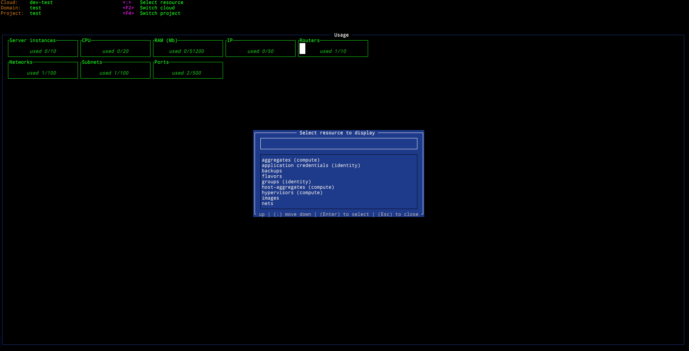

# Resource selection

Picking up a desired resource is done triggering the `ResourceSelect` popup
which is by default invoked by pressing `<:>` (like in vim or k9s). The popup
displays a list with fuzzy search where user is able to select the necessary
resource using one of the pre-configured aliases.

